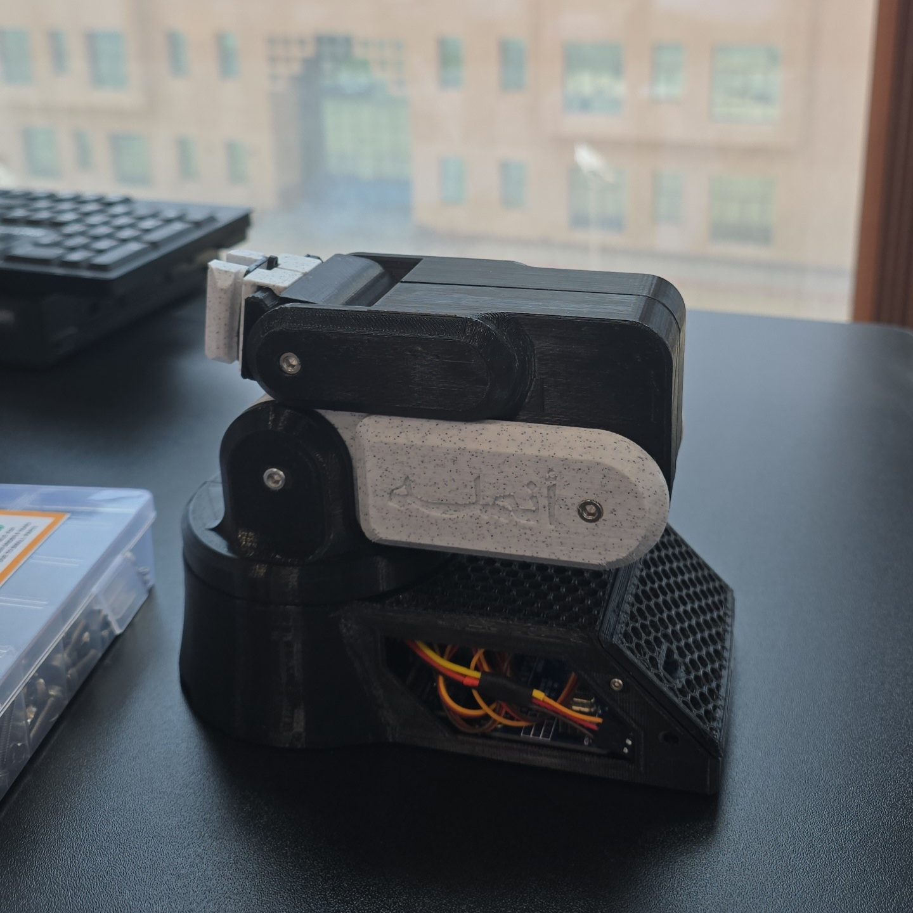

# Anmala | أُنْمُلَه

### An Arduino-Based 3D-Printed Robotic Arm — V1

## About

**Anmala V1** is an Arduino-based, 3D-printed robotic arm
implementation developed as a collaborative project.

The project covers the practical implementation of the robotic arm,
including hardware integration, 3D printing, assembly, calibration,
testing, and troubleshooting.

## The Name — أُنْمُلَه

كلمة **أُنْمُلَه** هي اسم المشروع، وقد تم اختيارها للدلالة على
التركيب المشابه للإصبع والمفاصل المتحركة وآلية القبض في الذراع الروبوتية.

The name **Anmala** was chosen to represent the finger-like structure,
articulated joints, and gripper mechanism of the robotic arm.

## Project Status

**Version:** V1  
**Status:** Completed

## Team

Anmala V1 was developed as a collaborative project by:

- Yousef Tawfiq
- Faisal Ayyash
- Samer Almarwani

The project was collaboratively implemented, assembled, tested,
and documented by the team.

## Hardware

The project uses:

- Arduino Board
- Servo Driver Board
- Standard Servo Motors
- 20KG Servo Motor
- Micro Servo
- Potentiometers
- 3S LiPo Battery
- Buck Converter
- Power Switch
- Controller Push Button
- Wires and Connectors
- T60 Plugs
- Mechanical screws and components
- Clear Acrylic
- Gripper Foam Pad
- Rubber Bands
- LED

More details:

[`01_Hardware/Components.md`](01_Hardware/Components.md)

## 3D Printing

The robotic arm components were manufactured using:

- Creality Ender-3 S1 Pro
- 0.4 mm nozzle
- PLA
- PETG

Both PLA and PETG were used during the build based on the
available materials and to provide different colors for the
printed components.

Klipper was also used as the printer firmware environment
during the project.

More details:

[`03_3D_Printing/Printing.md`](03_3D_Printing/Printing.md)

## Documentation

### Assembly

[`04_Documentation/Assembly/Assembly.md`](04_Documentation/Assembly/Assembly.md)

### Calibration

[`04_Documentation/Calibration/Calibration.md`](04_Documentation/Calibration/Calibration.md)

### Testing

[`04_Documentation/Testing/Testing.md`](04_Documentation/Testing/Testing.md)

### Troubleshooting

[`04_Documentation/Troubleshooting/Troubleshooting.md`](04_Documentation/Troubleshooting/Troubleshooting.md)

## Software

The Arduino control code will be added to:

`02_Software/Arduino`

## Original Design & Attribution

This project is an implementation of the original:

**Compact Robot Arm (Arduino) - 3D Printed**

**Original Designer:** Kelton

The original mechanical design is not claimed as our own.

This repository documents our implementation, hardware integration,
assembly, programming, testing, and troubleshooting of the robotic arm.

Full attribution and licensing information:

[`06_Attribution/Original-Design.md`](06_Attribution/Original-Design.md)

## Future Improvements

Potential future improvements may include:

- Improved control methods
- Additional functionality
- Further mechanical refinements
- Improved documentation
- Additional testing

## Credits

**Original Design:** Kelton

**Anmala V1 Team:**

- Yousef Tawfiq
- Faisal Ayyash
- Samer Almarwani
